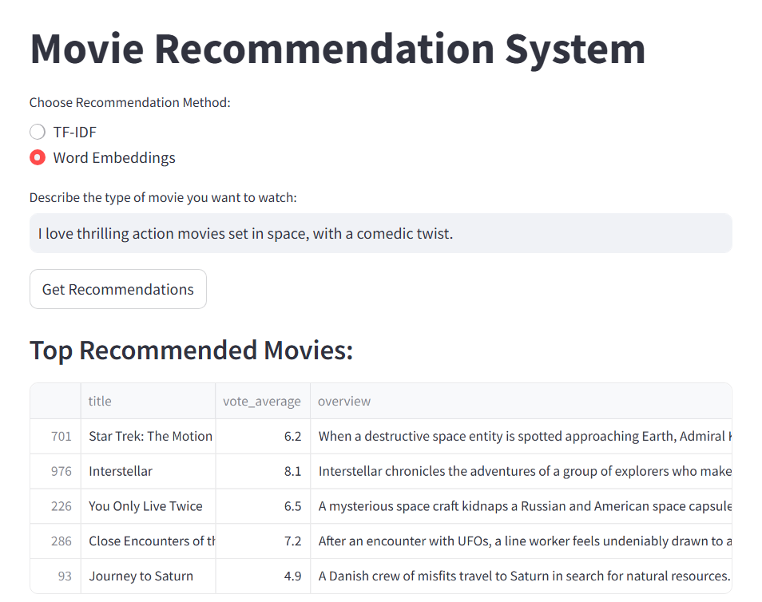

# Movie Recommendation System

## Overview
This project is a **content-based recommendation system** that suggests movies based on a short text description provided by the user. Given a dataset of movies with plot summaries, keywords, and genres, the system finds the most relevant movies using **TF-IDF with cosine similarity** or **word embeddings (SentenceTransformers)**.

## Features
- Users input a short description of their preferred movie type.
- The system processes this text and compares it with movie descriptions.
- Two recommendation methods are available:
  - **TF-IDF (Term Frequency-Inverse Document Frequency)**
  - **Word Embeddings (Sentence Transformers)**
- The system returns the **top 5 most relevant** movie recommendations.
- Higher importance is given to genre-related words to enhance relevance.
- The movie **title** is included in the text similarity search to improve results.
- The movie's **vote average** is factored into the ranking.

---

## Dataset
- The dataset used is the **TMDb Movie Metadata** from Kaggle (only 500 samples are used):  
  [TMDb Movie Metadata](https://www.kaggle.com/datasets/tmdb/tmdb-movie-metadata)

- The dataset is filtered to include only English-language movies with the following columns used.
- **title**: Movie title
- **overview**: Plot summary
- **tagline**: A short tagline describing the movie
- **genres**: Movie genres (e.g., Action, Comedy)
- **keywords**: Descriptive words associated with the movie
- **vote_average**: Viewer rating score
- **original_language**: Language of the movie (only English movies are considered)

The dataset should be in **CSV format** and stored as `movies.csv`.

---

## Installation
### Prerequisites
Ensure you have **Python 3.7+** installed.

### Install Dependencies
Run the following command to install all required packages:
```bash
pip install -r requirements.txt
```

### Required Libraries
- `pandas`: Data handling
- `numpy`: Numerical operations
- `sklearn`: TF-IDF and cosine similarity
- `sentence-transformers`: Word embeddings
- `streamlit`: Web-based UI
- `pickle`: Model saving/loading

---

## How to Run

### 1. Start the Web App
Run the following command to launch the Streamlit UI:
```bash
streamlit run movie_recom.py
```
This will start the interactive interface where you can enter a movie description and get recommendations.

---

## 🎥 Demo

**Video Demonstration:** [Watch the Demo](https://youtu.be/vu4j3xys68k)

---

## Usage
1. **Select Recommendation Method:** Choose between TF-IDF or Word Embeddings.
2. **Enter Movie Preferences:** Describe the type of movie you like (e.g., "I love action-packed space adventures with a touch of humor").
3. **Get Recommendations:** Click the button, and the system will return the most relevant movies.

---

## Recommendation Logic
### **1. Text Preprocessing**
- The `combined_text` column is created by merging **title, overview, tagline, genres, and keywords**.
- Stopwords are removed.

### **2. Text Representation**
- **TF-IDF** converts the text into numerical vectors, emphasizing important words.
- **Word Embeddings** use `all-MiniLM-L6-v2` to capture semantic meaning.

### **3. Similarity Computation**
- **Cosine Similarity** is calculated between the user query and each movie.
- **Genre-based Weighting** boosts scores if the query contains genre-related words.
- **Vote Average Normalization** ensures higher-rated movies are slightly favored.

### **4. Ranking & Output**
- Movies are ranked based on weighted scores.
- The top 5 most relevant movies are displayed.

---

## Example Query & Output
### **Input Query:**
Try entering:

- *"A thrilling space adventure with humor"*
- *"A deep emotional drama with a powerful storyline"*
- *"A fast-paced action movie with a sci-fi setting"*

### **Top Recommendations:**
If a user enters *"I love thrilling action movies set in space, with a comedic twist."*, the system might return:



---

## For better results we can :-
- **Improve Synonym Handling**: Expand queries using NLP-based synonym detection.
- **Fine-Tune Weights**: Adjust genre weightings dynamically.
- **Larger Dataset**: Use more extensive movie databases.

---

## Salary Expectation
Expected Monthly Salary: **$5,000 - $6,000**

---

## About Me
# Mohit Jain  

🎓 **Master's in Computer Science**  
🏫 **Arizona State University, USA**  

📧 **Email:** mjain107@asu.edu  
📞 **Phone:** +1 602-807-9067  

